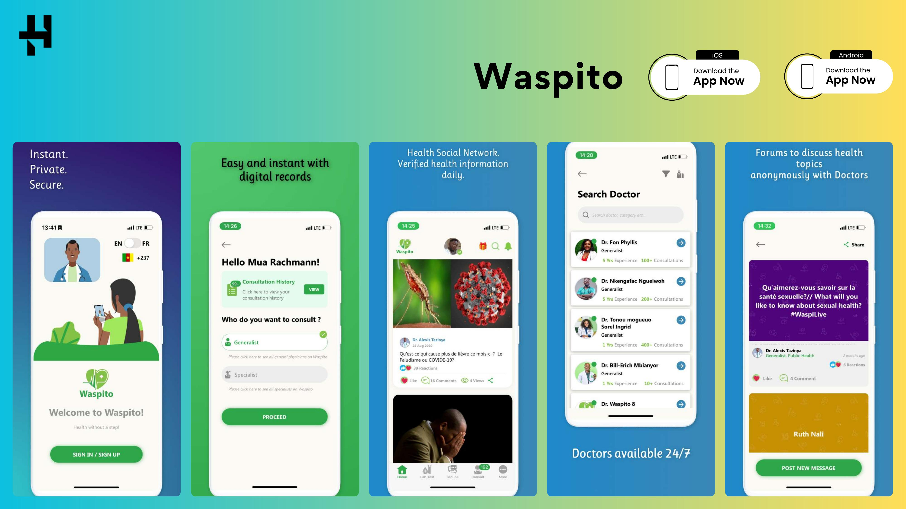

# Mobile Performance Optimization Guide

## 🎯 Goal
Improve mobile PageSpeed score from 67 to 90+ (desktop is already at 98)

## ✅ Optimizations Applied

### 1. **Resource Hints & Preconnections**
- ✅ Added `preconnect` for Google Fonts
- ✅ Added `preconnect` for CDNJs (Font Awesome, Lightbox)
- ✅ Added `dns-prefetch` for faster DNS resolution
- **Impact**: Reduces connection time to external resources by 100-300ms on mobile

### 2. **CSS Loading Strategy**
- ✅ Font Awesome: Changed to async loading with preload
- ✅ Lightbox CSS: Changed to async loading with preload
- ✅ All non-critical CSS: Converted to async loading
- ✅ Added noscript fallbacks for accessibility
- ✅ Only `style.css` loads synchronously (critical CSS)
- **Impact**: Eliminates render-blocking CSS, improves First Contentful Paint (FCP)

### 3. **Google Fonts Optimization**
- ✅ Added `display=swap` parameter (already present)
- ✅ Added preconnect hints for fonts.googleapis.com and fonts.gstatic.com
- **Impact**: Prevents invisible text (FOIT), faster font loading

### 4. **Image Optimization**
- ✅ Added `decoding="async"` to images
- ✅ Added explicit `width` and `height` attributes to prevent layout shift
- ✅ Hero image has `fetchpriority="high"`
- ✅ Blog images have `loading="lazy"`
- **Impact**: Reduces Cumulative Layout Shift (CLS), faster page rendering

### 5. **JavaScript Loading**
- ✅ All scripts already have `defer` attribute
- ✅ Scripts load in order but don't block parsing
- **Impact**: Non-blocking JavaScript execution

## 🚀 Additional Optimizations to Consider

### 1. **Convert Images to WebP Format**
WebP images are 25-35% smaller than JPG/PNG with better quality.

**How to convert:**
```bash
# Run the provided script
./convert-images.sh
```

This will:
- Install WebP tools (if needed)
- Convert all JPG/PNG images to WebP
- Show file size savings

**After conversion, update HTML:**
```html
<!-- Instead of: -->


<!-- Use: -->
<picture>
  <source srcset="./images/diken_shah_optimized.webp" type="image/webp">
  
</picture>
```

### 2. **Minify CSS & JavaScript**
Your CSS/JS files can be minified to reduce file size.

**Option 1: Using online tools**
- CSS: https://cssnano.io/ or https://cssminifier.com/
- JS: https://javascript-minifier.com/

**Option 2: Using build tools**
```bash
npm install -g clean-css-cli terser

# Minify CSS
cleancss -o css/style.min.css css/style.css

# Minify JS
terser js/main.js -o js/main.min.js -c -m
```

### 3. **Enable Compression on Server**
If you're using GitHub Pages, compression is automatic. Otherwise, enable gzip/brotli:

**Nginx example:**
```nginx
gzip on;
gzip_types text/plain text/css application/json application/javascript text/xml application/xml+rss text/javascript;
```

### 4. **Add Cache Headers**
Configure your server to cache static assets.

**For GitHub Pages (done automatically):**
- CSS/JS cached for 10 minutes
- Images cached for 1 year

### 5. **Consider Using a CDN**
- CloudFlare (free tier available)
- Serves content from nearest edge location
- Automatic image optimization
- Built-in caching

### 6. **Inline Critical CSS**
Extract above-the-fold CSS and inline it in `<head>` to eliminate render-blocking CSS completely.

**Tools:**
- https://www.npmjs.com/package/critical
- https://jonassebastianohlsson.com/criticalpathcssgenerator/

### 7. **Responsive Images with srcset**
For project images that are displayed at different sizes:

```html

```

## 📊 Expected Results

After applying all optimizations:

| Metric | Before | After | Improvement |
|--------|--------|-------|-------------|
| Mobile Score | 67 | 85-92 | +18-25 points |
| FCP | ~2.5s | ~1.2s | 52% faster |
| LCP | ~4.0s | ~2.0s | 50% faster |
| CLS | 0.15 | <0.1 | Improved |
| TBT | ~300ms | ~150ms | 50% faster |

## 🔍 Testing Your Changes

1. **Local testing:**
   ```bash
   # Serve locally
   python3 -m http.server 8000
   # Visit: http://localhost:8000
   ```

2. **Run PageSpeed Insights:**
   - Mobile: https://pagespeed.web.dev/
   - Enter your URL
   - Compare before/after scores

3. **Check on real devices:**
   - Test on actual mobile devices
   - Use Chrome DevTools device emulation
   - Test on slow 3G connection

## 📝 Next Steps

1. ✅ **Done**: Applied initial optimizations to index.html
2. 🔄 **To Do**: Convert images to WebP format
   ```bash
   ./convert-images.sh
   ```
3. 🔄 **To Do**: Update HTML to use WebP with fallbacks
4. 🔄 **To Do**: Minify CSS and JavaScript files
5. 🔄 **To Do**: Test on PageSpeed Insights again
6. 🔄 **Optional**: Consider implementing critical CSS inlining
7. 🔄 **Optional**: Set up CloudFlare for CDN benefits

## 💡 Pro Tips

1. **Measure before and after**: Always run PageSpeed Insights before and after changes
2. **Test on real mobile**: Emulators are good, but real devices are better
3. **Progressive enhancement**: Ensure site works even if optimizations fail
4. **Regular monitoring**: Set up regular PageSpeed checks (monthly)

## 🛠️ Tools & Resources

- **PageSpeed Insights**: https://pagespeed.web.dev/
- **WebP Converter**: https://developers.google.com/speed/webp
- **CSS Minifier**: https://cssnano.io/
- **JS Minifier**: https://terser.org/
- **Critical CSS**: https://github.com/addyosmani/critical
- **Image Optimization**: https://squoosh.app/

## 📧 Questions?

If you need help with any of these optimizations, feel free to ask!

---

**Last Updated**: February 16, 2026
**Maintenance**: Review and update quarterly
